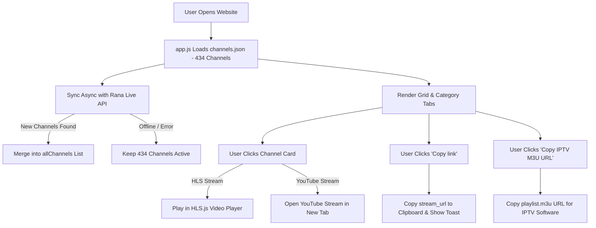

# Indian Regional IPTVs — Project Context & Developer Guide

## 📌 Project Overview
**Indian Regional IPTVs** is a fast, responsive, modern web player and IPTV playlist generator designed to host, stream, and manage live TV channels sorted by regional genres (Bengali, News, Devotional, Doordarshan, Punjabi, Tamil, Telugu, Malayalam, Movies, Music, etc.).

It provides a client-side web application equipped with an embedded HLS.js video player, live server synchronization, per-channel stream link copying, auto-refreshable M3U playlist integration for external IPTV software (TiviMate, IPTV Smarters, VLC), Picture-in-Picture (PiP), sticky mini-player on scroll, local storage favorites/recent history, and Smart TV QR code generation.

---

## 🏗️ Project Architecture & File Directory

Deployment Target Folder: `website/` (Ready for Netlify Drop, Vercel, GitHub Pages, or any static host).

```text
m3u8/
├── website/                         <-- COMPUTE / DEPLOYMENT FOLDER
│   ├── index.html                   # Core HTML markup & modal dialogs
│   ├── styles.css                   # Modern cyberpunk-dark glassmorphism styling
│   ├── app.js                       # Main application logic & state manager
│   ├── channels.json                # Master JSON database (434 channels)
│   ├── playlist.m3u                 # M3U playlist file for IPTV players
│   ├── m3u8_playlists.txt           # Text file export listing all stream URLs
│   ├── _redirects                   # Netlify rewrite rule (/api/playlist -> /playlist.m3u)
│   └── _headers                     # Netlify CORS & MIME type configuration
└── project-context.md               # Developer and Agent context documentation
```

---

## 📄 File Details & Responsibilities

### 1. `website/index.html`
- **Navigation Bar (`.navbar`)**: Contains project branding (`Indian Regional IPTVs`), live status badge (`● Live Server Connected`), search input, and top header control buttons (`Sync Server`, `Copy IPTV M3U URL`, `Download Fresh M3U`, `Text File`).
- **Player Wrapper (`#playerWrapper`)**: Embedded HLS.js video player with live channel title, Picture-in-Picture (`#btnPip`), TV QR Code (`#btnQrCode`), and floating mini-player close button (`#btnMiniClose`).
- **Category Navigation (`#categoriesBar`)**: Filter tabs for categories, including `All`, `⭐ Favorites`, `🕒 Recent`, and regional genres.
- **Channel Cards Grid (`#channelsGrid`)**: Dynamic grid rendering channel cards.
- **QR Code Modal (`#qrModal`)**: Modal dialog for displaying QR codes to scan stream URLs onto Smart TVs or mobile devices.

### 2. `website/styles.css`
- Modern **Cyberpunk-Dark & Glassmorphism** design system built with CSS variables (`--bg-primary`, `--accent-cyan`, `--accent-glow`, `--glass-border`).
- **Animations**: `fadeIn`, `pulse`, `toastIn`, `toastOut`, `miniPlayerIn`.
- **Key Classes**:
  - `.video-container.mini-player`: Sticky mini-player floating at bottom-right corner when scrolling.
  - `.card-actions` & `.copy-m3u8-btn`: Styling for card action container and "Copy link" button.
  - `.fav-star.active`: Star button styling for favorited channels.
  - `.toast` & `.toast-container`: Floating toast notification system.

### 3. `website/app.js`
- **Live Channel Merging (`loadLiveChannels()`)**:
  1. Fetches `channels.json` (434 base channels) for zero-latency initial load.
  2. Asynchronously syncs with Rana's backend API (`https://ranacabletv.alwaysdata.net/oxoo/rest-api/v100/all_tv_channel_by_category`) via CORS proxy (`https://corsproxy.io/?...`).
  3. Merges any newly added live channels from the API server without losing any base channels.
- **Playback Manager (`playChannel()`)**:
  - Handles HLS (`.m3u8`) playback via `Hls.js` or native Safari HLS.
  - Detects YouTube live links (`youtube.com`, `youtu.be`) and opens them in a new tab cleanly with toast notifications.
  - Adds played channels to `localStorage` recent history (`iptv_recents`).
- **Favorites System**: Uses `localStorage.getItem('iptv_favorites')`. Favorites can be filtered using the `⭐ Favorites` category tab.
- **Picture-in-Picture (`btnPip`)**: Triggers native `videoPlayer.requestPictureInPicture()`.
- **Sticky Mini-Player**: Uses scroll event monitoring. Docks video container to bottom-right when scrolled past the player section.
- **Clipboard Utility (`copyToClipboard()`)**: Copies stream links with fallback support for legacy or non-HTTPS environments.

### 4. `website/channels.json`
- JSON array of 434 channel objects:
```json
{
  "id": "usr-1",
  "name": "10 TV",
  "genre": "News",
  "stream_url": "https://cdn-1.pishow.tv/live/391/master.m3u8",
  "stream_from": "hls",
  "thumbnail": "",
  "poster": ""
}
```

### 5. Netlify Config Files (`_redirects`, `_headers`)
- `_redirects`: Maps `/api/playlist` to `/playlist.m3u` with 200 HTTP status.
- `_headers`: Applies `Access-Control-Allow-Origin: *` CORS header and sets `audio/x-mpegurl` MIME type for `.m3u` files.

---

## ⚡ Data Flow & Workflow Summary



---

## 💡 Important Rules for Future AI Agents / Developers

1. **Client-Side First**: Do NOT add user accounts, login, or registration options unless explicitly requested by the user. Keep favorites and history in `localStorage`.
2. **Preserve User Channels**: Never remove or filter out any of the 192 user-provided channel entries during deduplication. All duplicates, YouTube links, and RTMP streams are intentional.
3. **Dual File Sync**: Always maintain parity between root files and files inside `website/`.
4. **Clipboard Fallbacks**: Use `copyToClipboard()` helper to guarantee copy functionality across HTTP, HTTPS, and mobile WebViews.
5. **Netlify Drop Compatibility**: Ensure `website/` remains self-contained with relative paths (`app.js`, `styles.css`, `channels.json`, `playlist.m3u`, `_redirects`, `_headers`).
